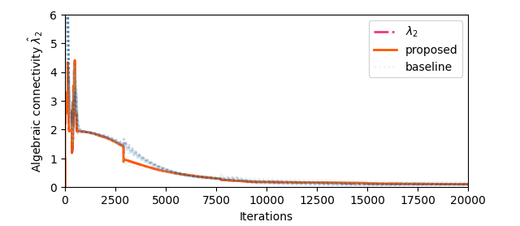
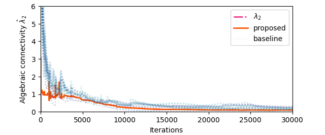

# Distributed Connectivity Estimation

**Review Only**

## File Overview

This repository contains figures and code corresponding to the experiments described in the paper.

### Simulation Scripts in the Paper

* `01-WeightedCase.py`: Simulation for the weighted graph scenario.
* `02-StaticCase.py`: Simulation for the static graph scenario.
* `03-l2l3Close.py`: Simulation testing behavior when $\lambda_2 \approx \lambda_3$.

### Supporting Files

* `A.py`: Defines the graph structures used in simulations.
* laplacians Folder: Contains the time-varying graph data. Each row represents a flattened Laplacian matrix that evolves over time.

### Algorithms.py

This file contains implementations of the following distributed algorithms:

1. `Step`: The original method from Aragués et al.
2. `StepV2`: The proposed algorithm with exponential convergence.
$$
        \hat{\lambda}_2(k) = \frac{1}{\beta} \left(1 - \max_{j \in \mathcal{V}} \tilde{c}_j^k \right)
$$
3. `StepV2Diff`: A variation of the proposed method **without normalization**.
$$
\hat{\lambda}_2(k) = \frac{1}{\beta} \left(1 - \frac{\max_{j \in \mathcal{V}} c_j^k}{\max_{j \in \mathcal{V}} c_j^{k-1}} \right)
$$
4. `IterFielderAndConnectivity`: This is a discretized Euler-form method from Zhang's work for estimating the Fiedler vector and algebraic connectivity. Further details can be found in [S3-TimeVaryingGraph.ipynb](S3-TimeVaryingGraph.ipynb). Due to the method's nonlinear nature, analyzing its convergence conditions remains challenging.

In contrast, the **proposed method** achieves **faster convergence**, demonstrates **numerical stability**, and is supported by **theoretical convergence guarantees**.

## Average Performance Evaluation

To assess average-case performance, several test scenarios from prior works are reproduced:

* **S1 – String Graph**: Based on the test in Ref. \[1].
* **S2 – Graph5**: 5-agent graph from Ref. \[2], used to evaluate **numerical stability**.
* **S3 – Time-Varying Graph**: Mock dynamic topology to test robustness.
* **S4 – Time-Varying Graph (N=6)**: Small-scale dynamic graph scenario.

* **S5 – Time-Varying Graph (N=16)**: Larger dynamic network with 16 agents.

Note: there are no formal analysis for time-varying graph.

## Reference
[1] R. Aragues, “Distributed algebraic connectivity estimation for undirected graphs with upper and lower bounds,” Automatica, 2014.

[2] Y. Zhang, S. Li, and J. Weng, “Distributed Estimation of Algebraic Connectivity,” IEEE Transactions on Cybernetics, vol. 52, no. 5, pp. 3047–3056, May 2022, doi: 10.1109/TCYB.2020.3022653.
